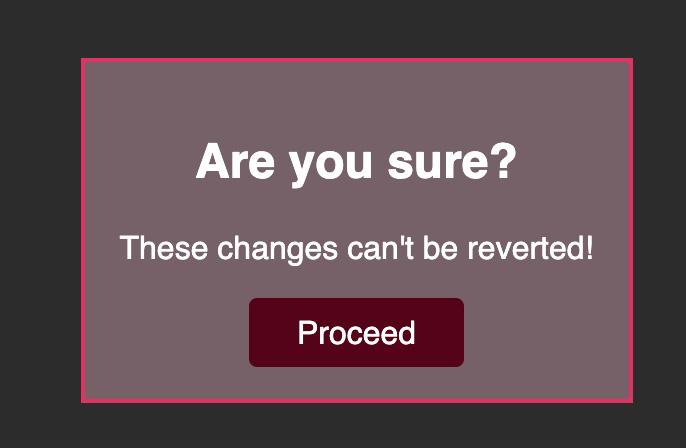

# Conditional Content

You're working on a part of a web app that's responsible for <b>showing a warning</b> when a user is about to perform a dangerous action.

Therefore, your task is to <b>conditionally</b> show a warning box once a user has <b>clicked</b> a specific button. Inside that warning dialog, another button allows users to <b>dismiss the warning</b> (i.e., remove the warning box from the screen).

The finished app should display this UI, if the `<button>` has not been clicked yet:

And this UI, once the button was clicked:

Once the "Proceed" button was clicked, the warning box should be removed again:

For this task, you must react to clicks on both `<button>` elements that are part of the starting code. The second button, outside of the `
` with the `id="alert"`, should show the `
` (and all its content). The button inside that `
` should then hide it again (i.e., remove it from the DOM).

It's up to you whether you want to use a ternary expression or store the conditionally shown JSX code in a variable.

<i>Important: In this Udemy code editor you may get an error if you use `useState()` - use `React.useState()` instead!</i>

# Learning objective

Show (and hide) content dynamically.
