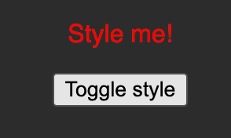

# Dynamic Styling

Your task is to <b>dynamically</b> apply a CSS class (`active`) to the `
Style me
` element in the provided React app.

The class should be applied when the `<button>` is clicked for the first time.

Here's how the finished app should look like BEFORE the button was clicked:

Here's how it should look like AFTER the button was clicked:

<i>Important: Use `React.useState()` instead of just `useState()` as the latter can cause problems in this Udemy code environment.</i>

# Learning objective

Apply CSS styles dynamically to HTML elements.
