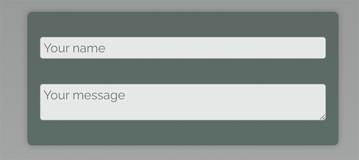

# Forwarding Props

Your task is to work on the `Input` component such that it either returns a `<textarea>` element or an `<input>` element, depending on whether a `richText` prop set on `Input` is true or false.

I.e., if used like this:

```
<Input richText />
```

the `Input` component should render a `<textarea>`. Otherwise, it should render an `<input>`.

In addition, the `Input` component should forward all other props directly to the returned `<textarea>` or `<input>` elements.

I.e., it should be usable like this:

```
<Input type="text" placeholder="Your name" />
```

<i>(as seen in the existing `App.js` file)</i>

The final UI should look like this:


# Learning objective

Build a reusable, custom Input component that either renders a `<textarea>` or an `<input>` and "forwards" all props to those elements.
