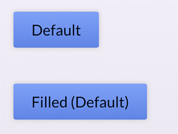
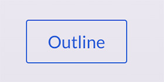
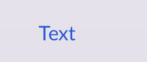
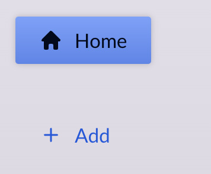

# Creating Flexible Components

Your task is to build a <b>highly re-usable</b>, custom `Button` component that can be used in all the following ways <i>(also see the code in the `App.js` file)</i>:

## "Filled" mode (default):

```
<Button>Default</Button>
```

or

```
<Button mode="filled">Filled</Button>
```

should yield buttons that looks like this:



## "Outline" mode:

```
<Button mode="outline">Outline</Button>
```

should yield a button that looks like this:



## "Text-only" mode:

```
<Button mode="text">Text</Button>
```

should yield a button that looks like this:



## With Icon:

```
<Button Icon={HomeIcon}>Home</Button>
```

or

```
<Button Icon={PlusIcon} mode="text">
    Add
</Button>
```

should yield buttons that look like this:



<i>Hint: To make sure the icon becomes visible (if passed correctly to the component & used in there), wrap the icon component in the button with a `<span>` that has the class `"button-icon"` on it.

Also wrap the `children` prop with a `<span>`!</i>

You find all the styles (CSS classes) that are required to build a button that supports these different "modes" in the provided `index.css` file!

All buttons need a `button` CSS class - and then, depending on their mode, additional classes.

In addition, the custom `Button` component <b>must accept</b> all <b>standard props</b> that could be set on the built-in `<button>`. These props should be <b>forwarded</b> to the default `<button>` element that will be used in the custom Button component.

Your task therefore is to work on the `Button` component provided in the `Button.js` file. <b>Don't</b> add multiple custom components, instead work on that <b>one</b> provided component and make sure that it supports all these different modes & features. Also make sure, that if no mode is set, the <i>"filled"</i> mode is assumed as a default.

# Learning objective

Build a highly flexible & dynamic custom Button component that supports different styles and modes.
