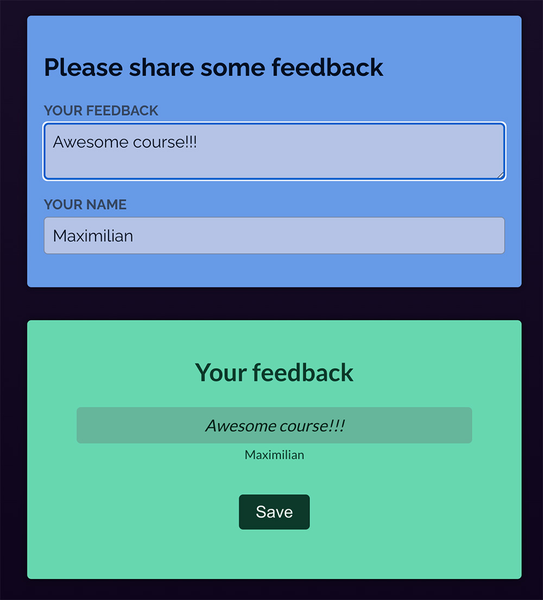

# Two-Way-Binding

Your task is to <b>collect the values</b> entered into the two input controls (`<textarea>` and `<input>`) via <b>two-way binding</b>.

In addition, you should <b>pass</b> the collected values via the appropriate props to the already existing `Review` component.

<i>Important: In this Udemy workspace, you must use `React.useState()` instead of just `useState()`!</i>

The final app should allow users to enter values and then see those entered values in the `Review` component which is output below the input components. It should look like this:

The <i>"Save"</i> button is just there for decoration purposes - you don't need to do anything with that!

# Learning objective

Use two-way-binding to collect user input and output the entered text in a "preview area" of the example web app.
