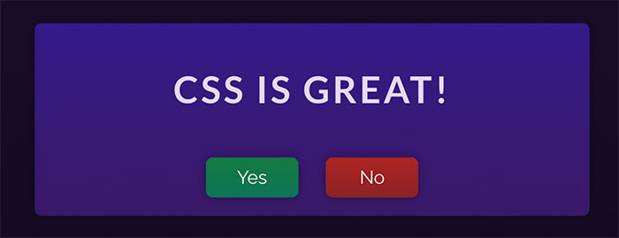
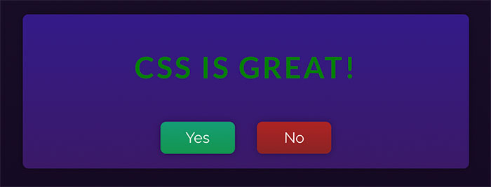
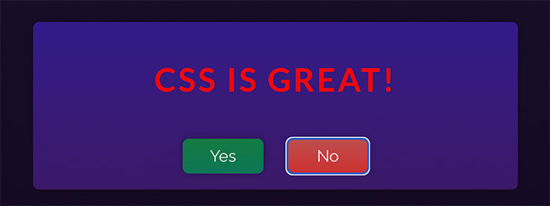

# Dynamic Styling with CSS Classes

Your task is to enhance the demo app that's given to you such that clicking the <i>"Yes"</i> and <i>"No"</i> buttons changes the styling of the `h1` heading element.

Whenever the <i>"Yes"</i> button is clicked, the `"highlight-green"` CSS class should be set on the `h1` element. For the <i>"No"</i> button, it's the `"highlight-red"` class that must be applied.

If not button was clicked yet, no CSS class should be added to the `h1` element.

Therefore, initially, if no button was clicked, the app should look like this:

If the <i>"Yes"</i> button is clicked, it should look like this:

And if the <i>"No"</i> button is clicked, the following look should be the result:

<b>Important:</b> In this Udemy exercise environment, React hooks must be used directly on the imported `React` object (`import React from 'react'`). For example, `useState` would then be called like this: `React.useState()`.

# Learning objective

Dynamically style a heading with CSS classes, based on which button was clicked.
