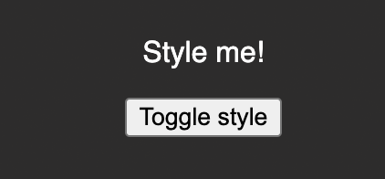
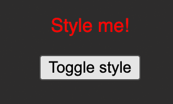

# Dynamic Styles

Your task is to <b>dynamically</b> apply a style (color: red) to the `
Style me
` element in the provided React app.

The style should be applied as an <b>inline style</b> (i.e., via the `style` attribute / prop) when the `<button>` is clicked for the first time. Once the button is clicked again, the styling should switch back to `color: white`, which should also be the initial style.

Make sure that the button toggles between these two styles (`color: white` <=> `color: red`).

Here's how the finished app should look like BEFORE the button was clicked:

Here's how it should look like AFTER the button was clicked:

And here's how it should look like when the button was clicked again:

<i>Important: Use `React.useState()` instead of just `useState()` as the latter can cause problems in this Udemy code environment.</i>

# Learning objective

Apply CSS styles dynamically to HTML elements.
