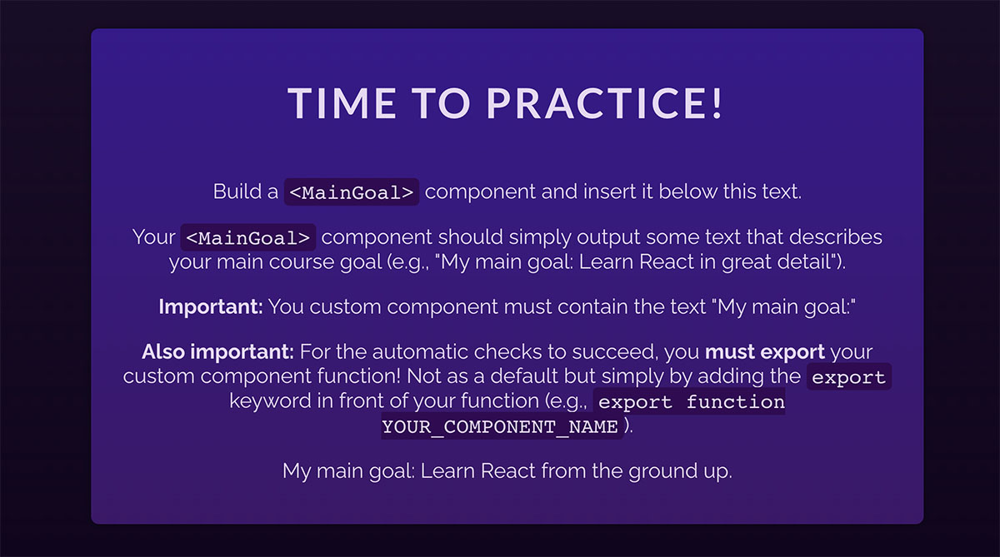

# Building & Using a Component

Your task is to create a new `MainGoal` component which outputs a paragraph of text that describes your main course goal (e.g., <i>"My main goal: Learn React in-depth and from the ground up"</i>).

You'll have to create this new component from scratch and then use it inside the `App` component's JSX code.

The finished app could look like this:

<i>(notice the "My main goal: Learn react from the ground up" text at the bottom)</i>

<b>Important:</b> To ensure that the automatic checks correctly detect your solution, your component <b>must be called</b> `MainGoal` and it also <b>must be exported</b>. To do that, simply add the export keyword in front of your `MainGoal` component.

The `MainGoal` component also <b>must contain the text</b> <i>"My main goal:"</i> (followed by whatever your main course goal is).

# Learning objective

Create a basic React component and use it in the JSX code of another component.
