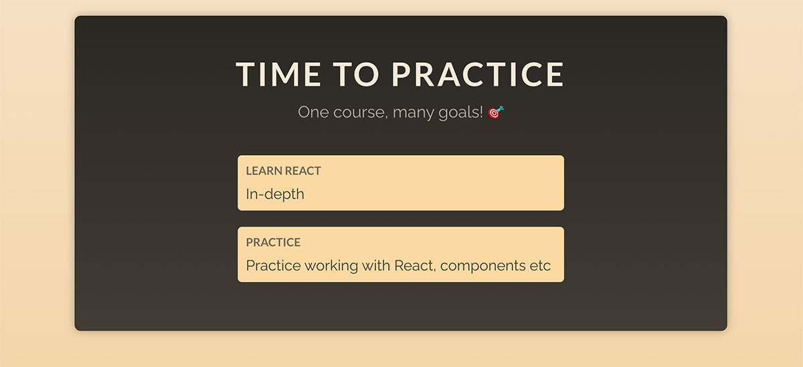

# Working with Props

Your task is to make the `CourseGoal` component reusable / configurable. It should accept a <i>"title"</i> and a <i>"description"</i> input and output the received data between the `<h2>` (title) and `
` (description) tags.

The `App` component should then render <b>at least two</b> instances of the `CourseGoal` component.

<b>One of those</b> `CourseGoal` components <b>must</b> receive a title of <i>"Learn React"</i> and a description of <i>"In-depth"</i>. The other titles and descriptions are entirely up to you.

The finished app could look like this:

# Learning objective

Build and use a reusable CourseGoal component to display a list of your goals for this course.
